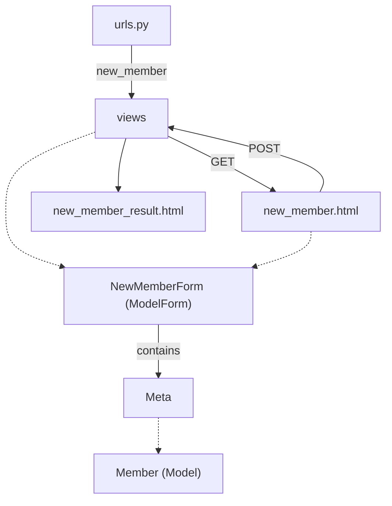

## 網球會員系統

本版本：form_post
前一版本：form_get

更新：
* 使用 ModelForm 來製作輸入介面

啟動：
* py manage.py runserver
* 開啟瀏覽器：[http://127.0.0.1:8000](http://127.0.0.1:8000)
* 點選 /members/new_member 連接

學習內容
* 了解 form 的設計: Form 和 Model 的差異
* get 和 post 的差異; 運作時機
* post 後, 如何 save 到資料庫

You should know
* 當我們連接到一個有 form 的頁面，先是一個 GET 的請求，當我們按下 submit 時，可能會送出 GET 或 POST -- 依據 form method 的指定。

---

### 用表單新增會員 (`form_post`)

> [!NOTE]
> 🏈 You will learn
> * POST request 如何被處理，如何將使用者輸入的資料存到資料庫
> * ModelForm 的設計與應用

1. 設計一個資料表單 [NewMemberForm](/members/forms.py), 可以用來呈現介面，同時儲存到資料庫。記得是繼承 `ModelForm`。
2. 新增路由到 [urls.py](/members/urls.py)
3. 設計 [new_member.html](/members/templates/new_member.html): 透過 POST 方式，將提交的資料存到資料庫。注意我們是用資料表單來產生介面表單(`form.as_p()`)。
    * `as_p`: as paragraph
    * `as_table`: table
    * `as_ul`: list
    * 資安考量，POST 請求都必須加上 ``。
        * **目的**：防止跨站請求偽造 (Cross-Site Request Forgery, CSRF) 攻擊，確保 POST 請求是來自網站本身的表單，而非惡意網站的偽造請求。
        * **原理**：Django 會在表單中插入一個隱藏的 `<input>` 欄位，內含隨機生成的 token 字串，同時在瀏覽器 Cookie 中也會記錄對應的 token。當表單提交時，Django 伺服器會比對請求中的 token 與 Cookie 中的 token 是否相符，若不符則會拒絕該請求 (回傳 403 Forbidden 錯誤)。
4. 在 [view.py](/members/views.py) 中加上 `new_member(request)`: 判斷是 `POST` 請求後，依據取得的資料(`request.POST`)生成一個 `NewMemberForm` 物件，檢查此提交的表單是否正確 (`is_valid`)，確認正確後直接呼叫 `save()` 儲存。
    * 若無法儲存，可以透過 `form.error` 取得錯誤資訊。
    * 如果是 GET 請求，將之轉到 `new_member.html`
5. 無論成功或失敗，都引導到 [new_member_result.html](/members/templates/new_member_result.html)

> CSRF 攻擊（Cross-Site Request Forgery，跨站請求偽造）是一種挾制使用者在當前已登入的 Web 應用程式上執行非本意操作的網路攻擊手法。攻擊者會利用瀏覽器自動夾帶 Cookie 的機制，盜用使用者在目標網站的身分憑證來發送惡意請求。CSRF 攻擊之首要條件是使用者必須先通過目標網站的身分驗證。其典型攻擊流程如下：
1. 登入網站：使用者登入信任的銀行網站 `A.com`，瀏覽器在儲存認證 Cookie 後未登出。
2. 點擊惡意連結：使用者在未登出的情況下，點擊了駭客佈署的惡意網站 `B.com`。
3. 觸發偽造請求：惡意網站 `B.com` 隱藏了針對 `A.com` 的轉帳或修改密碼表單，並在背景自動提交。
4. 瀏覽器發送憑證：瀏覽器處理該請求時，會自動帶上使用者在 `A.com` 的 Cookie 憑證。(雖然 B 不知道 Cookie 的內容，但因為 `B.com` 的目標也是 `A.com`, 瀏覽器會自動帶上 `A.com` 的 Cookie)
5. 目標網站誤信：`A.com` 收到帶有正確 Cookie 的請求，誤以為是使用者的自主操作而執行。

