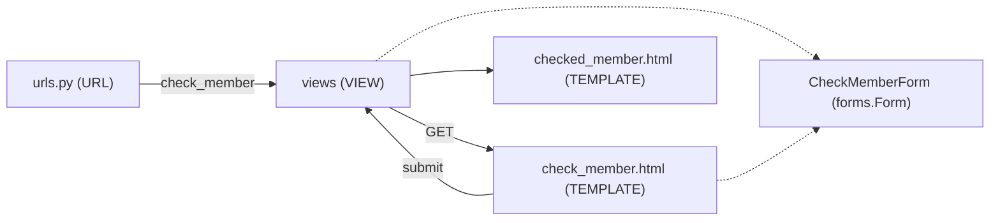

## 網球會員系統

本版本：form_try
前一版本：index

更新：
* 使用 form 來製作輸入介面

啟動：
* py manage.py runserver
* 開啟瀏覽器：[http://127.0.0.1:8000](http://127.0.0.1:8000)
* 點選 inputform 連接

學習內容
* 了解 form 的設計
* 了解直接由 model 來建立 form
* form 在 html 的呈現
* get 和 post 的差異; 運作時機
* post 後, 如何 save 到資料庫

---

> [!NOTE]
> 🏈 You will learn
> * 如何設計一個輸入表單，和後端的 django 互動
> * form GET 和 POST 的差異

* 做一個輸入表單，透過 lastname 來查詢會員

#### 查詢頁面
> check_member.html: 

```html
<form action="" method="GET">
  <label for="last_name">Last name:</label><br>
  <input type="text" id="last_name" name="last_name"><br><br>
  <input type="submit" value="Submit">
</form> 
```
或是由後端來做，設計一個 [CheckMemberForm](members/forms.py) - 它是 `forms.Form` 的子類別：

```html
<form action = "" method = "GET">
    {{ form.as_p }}
    <input type="submit" value='Submit'>
</form>
```
* `as_p` 是將 form 用 p 元件來呈現，其他還有 `as_table`, `as_list`



#### 路由設定

加上新的路由到 [urls.py](/members/urls.py)
```python
path('members/check_member', views.check_member, name='check_member'),
```


#### 查詢的處理 (views)

* 第一次呼叫 [views.check_member](/members/views.py), 是由 urls 導向過來的，`request.method` 是 `GET`, 但 `request.GET` 是空的。此時我們引導到 [check_member.html]/members/templates/check_member.html)
* 當使用者在 `check_member.html` 中輸入 `last_name` 的值並提交後，會再次執行 `views.check_member`, 此時 `request.GET` 會包含使用者在 form 中所填寫的值。我們透過 `Member.objects.filter()` 來找到所有符合條件的物件，在引導到 [checked_members.html](/members/templates/checked_members.html).