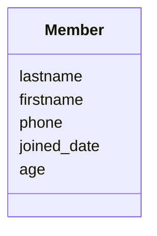

### 9.4.1 ex01: tag if (age)
> [!NOTE]
> 🏈 年齡分組
> * 在 model 中為會員增加一個欄位 age
> * 修改 all members, 會分兩個區塊，一個是小於 20 歲的青少年組，一個是超過 20 歲的成人組。
> 
> 學習重點
> * template tag: if
> * `py manage.py makemigrations`; `py manage.py migrate`
> * See branch **[age](https://github.com/nlhsueh/nlh_tennis_club/tree/age)**
> 

Code:
```html

    
        <li><a href="details/{{ x.id }}">{{ x.firstname }} 
        {{ x.lastname }}</a>, {{x.age}}</li>
        

```    