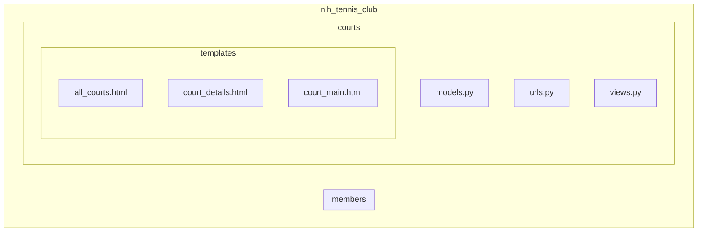

### 9.4.2 ex02: enum (court)
> [!NOTE]
> 🏈 網球場
> * 在 model 中增加一個資料球場: 球場名稱、球場型態（草地、硬地、泥地、地毯)，所在城市。
> * 修改系統，可以透過 /courts 列出所有的球場，點擊該球場可以看到球場細部資料。
> 
> 學習重點
> * 一個系統可以有多個 app (子系統)
> * 資料庫中列舉性的資料型態處理
> * See branch **[court](https://github.com/nlhsueh/nlh_tennis_club/tree/court)**

Hint
* 建立 courts 的 App (`py manage.py startapp courts`)
* 建立一個 Courts 的 model
* 參考 members app 的做法，加入對 courts 的程式
* 使用 choices 來做列舉型態

> See [Court](https://github.com/nlhsueh/nlh_tennis_club/blob/court/courts/models.py) model

 

 
